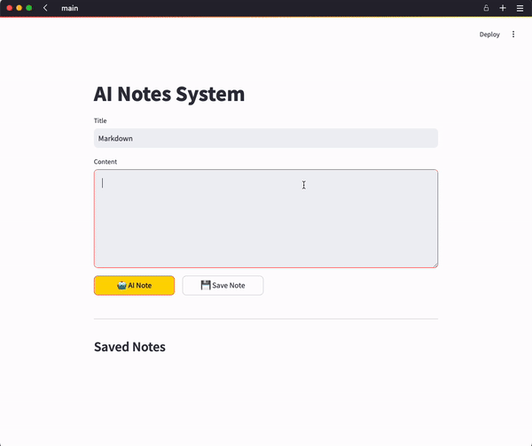

# ai-notes-system

An AI-powered note-taking system built with MongoDB and Streamlit. Features clever note structuring and AI summaries. Demonstrates full-stack development skills and AI integration for Python engineering portfolio.

> [!NOTE]
> [Development Notes](./docs/develop_note.md) 
> - Detailed development process, technical decisions, and learning journey

## Features

- Create and save notes with title and content
- Automatic timestamp for each note
- View all notes in an expandable list
- Copy notes in markdown format to the clipboard
- Delete unwanted notes
- MongoDB integration for persistent storage
- Streamlit-based user interface

## Feature Demonstration

### AI Summaries


### Markdown Note


## Installation Instructions

1. Clone the repository:
   ```sh
   git clone https://github.com/yourusername/ai-notes-system.git
   cd ai-notes-system
   ```

2. Create and activate a virtual environment:
   ```sh
   python -m venv venv
   source venv/bin/activate  # On Windows, use: venv\Scripts\activate
   ```

3. Install the required dependencies:
   ```sh
   pip install -r requirements.txt
   ```

4. Set up your environment variables:
   - Create a `.env` file in the root directory
   - Add your MongoDB URL and OpenAI API key:
     ```
     MONGODB_URL=your_mongodb_url
     OPENAI_API_KEY=your_openai_key
     ```

## Usage Guide

1. Start MongoDB:
   ```sh
   # If installed via Homebrew
   brew services start mongodb-community
   
   # Verify MongoDB is running
   brew services list
   ```

2. Start the Streamlit application:
   ```sh
   # From the project root directory
   streamlit run src/main.py
   ```

3. Using the Note-Taking System:
   - The application will automatically open in your default web browser
   - If not, navigate to the URL shown in the terminal (typically http://localhost:8501)
   - Create new notes using the input form
   - Notes will be automatically processed and structured
   - Use the search functionality to find specific notes
   - Toggle between English and Chinese language support as needed

4. Running Tests:
   ```sh
   pytest tests/
   ```
